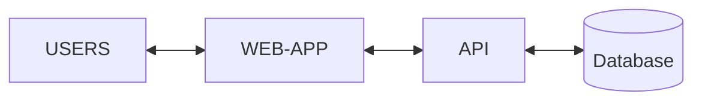
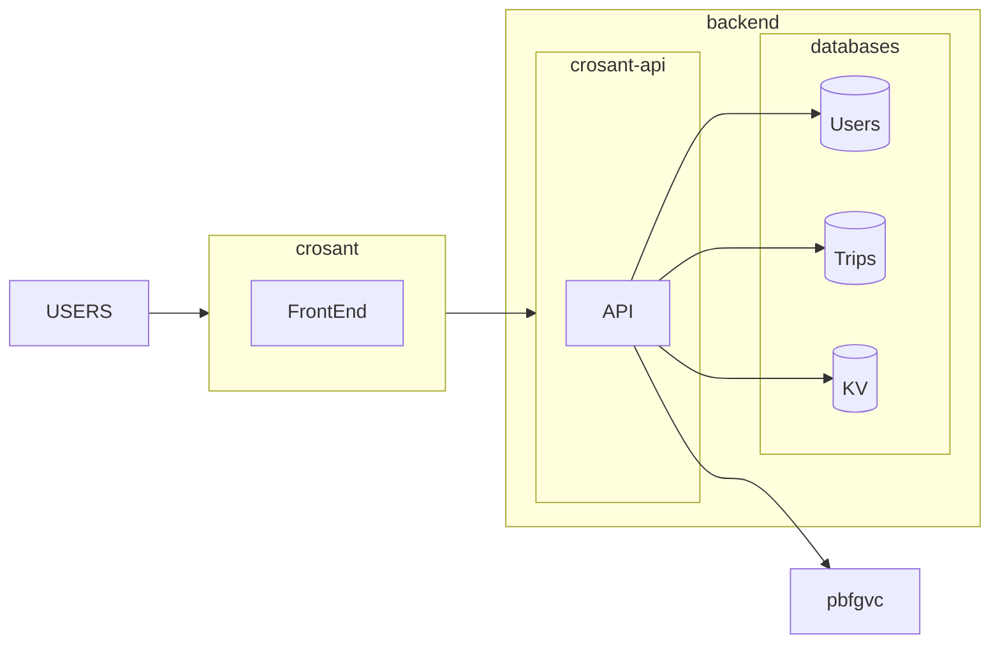

# Crosant Backend
The database for this project is hosted in CloudFlare. We are using mostly their [Worker D1](https://developers.cloudflare.com/d1/get-started/) database, this means we have to use [Wrangler](https://developers.cloudflare.com/workers/wrangler/) to deploy any changes. 
# API 

API management, consists of a set of tools and services that enable developers and companies to build, analyze, operate, and scale APIs in secure environments. API management can be delivered on-premises, through the cloud, or using a hybrid on-premises – SaaS (Software as a Service) approach.

Popular API uses include enabling the implementation of libraries and frameworks across languages, specifying the interface between an application and an operating system, manipulating remote resources through protocols, and defining the interface through which interactions happen between a third-party and the applications that use its assets. From independent mobile developers and web developers to large enterprises and governmental agencies, APIs are increasingly leveraged across industries and use cases.
- ## Usefull Links
    - [The basic of Rest](https://www.geeksforgeeks.org/rest-api-introduction/)
    - [Understand Rest](https://stackoverflow.com/questions/671118/what-exactly-is-restful-programming)
# Our Architecture
## Simple Version


## What We want to really build 

## [Hono](https://hono.dev/) 

We are using Hono mostly for simplicity and easy interaction with D1. 

# Current State
At the moment, we only have the most basic functionality with 12 endpoints.  We the hope of  expension. 
## Trip 
```JavaScript
//Return all the Trips. 
app.get('/trip'); 
//Creates a new Trip 
app.post('/trip');
//Edit a specific trip.
app.patch('/trip/:id') ;
//Delete a specific trip.
app.delete('/trip/:id');
```
## Locations
```JavaScript

app.get('/trip/:id/locations');

app.get('/trip/location/:id');

app.post('/trip/:id/location');

app.patch('/trip/location/:id');

app.delete('/trip/location/:id');

```
## Todo 
```Javascript

app.get('/trip/location/:l_id/todo');

app.post('/trip/location/:l_id/todo');

app.patch('/trip/location/todo/:id');

app.delete('/trip/location/todo/:id') 
```
# Changes
### ID's 
While the current version of this end points where as intented. There is some changes that need to be editted. The id functanality at the moment for Trip, Locations, and Todo are all increment id, 1,2,3,..etc, this can work in our current iteration, but this is something that needs to be change into something more secure. I would like to change this to more random characters, Acw2124S. We have to change the schema.sql and all the endpoint and create a method where creates ID for Trip,Location, and Trip. 

### Security
We have [basic auth](https://developer.mozilla.org/en-US/docs/Web/HTTP/Headers/Authorization)
in our database, but this will have to change once we have user capability. We can change this to token, but we will also have find a way to autheticate users through username and password. 
Basic Auth -> Token or better options
# Future Features 
### Users 
Currently we don't have user creation functionality. Which is something that we are looing to add in the future. We would like to add the capability for sessions or the usage [JWT](https://jwt.io/). 
### Refactor 
 Once user's capability are working. We got to refactor portion of current features. If a users call an endpoint we are only returning the data related to the user. 
### User Privileges 
A functions where user1 can share a Trip with user2 who can edit the trip. User1 is can only deleted Trip. User1 can give me permission/ownership to user2 if they want. user1 can revoke user privileges. 
- User privileges
    - Owner
    - View 
    - Edit 
### User Finances
Another Feature that we would like to add is finances. Each Trip has to have the capacity to have their own finances. 
